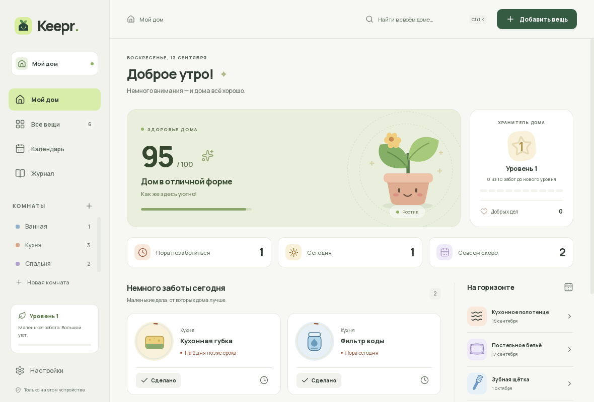
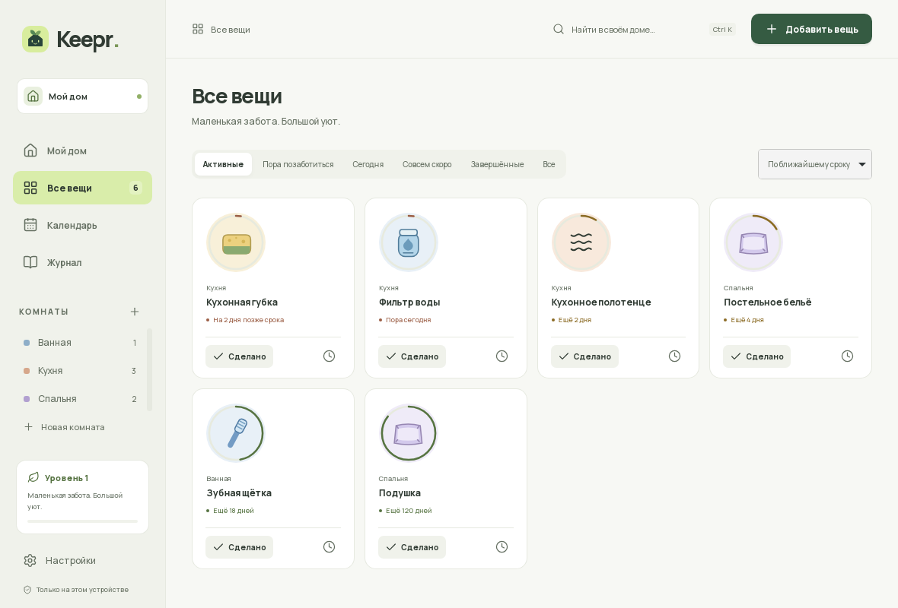
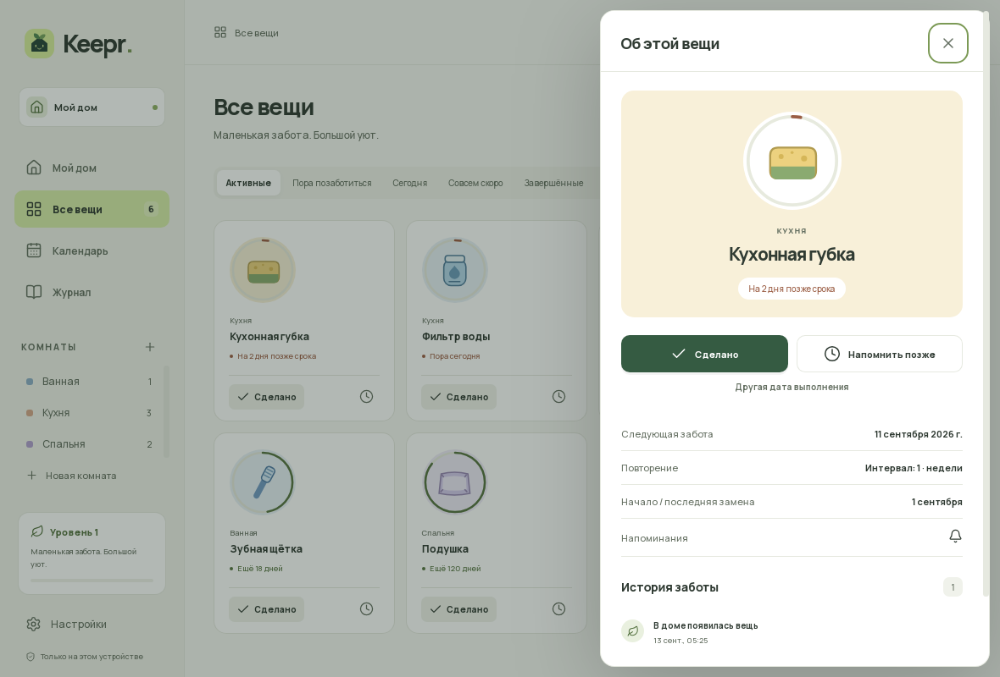
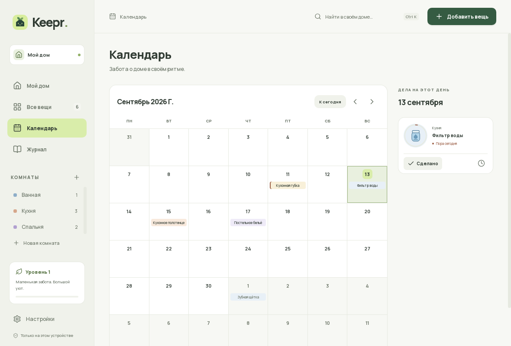
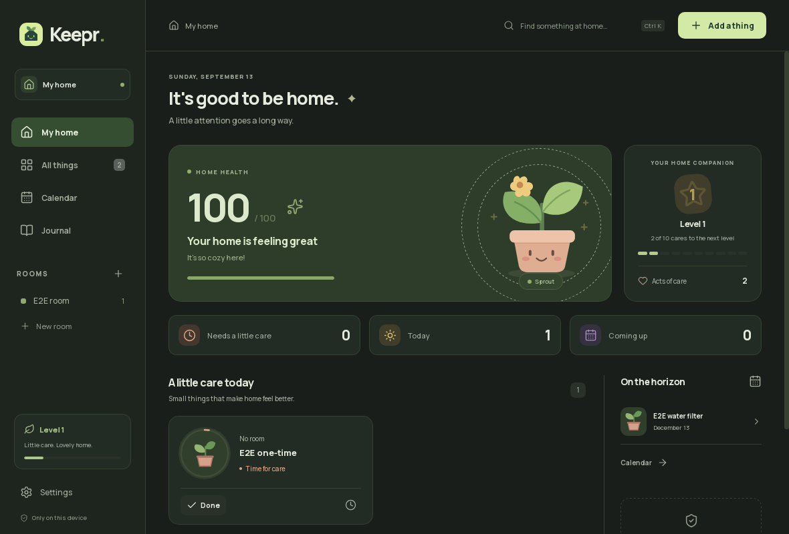

# Keepr 🌱

[](https://github.com/JustRelaXX/Keepr/actions/workflows/check.yml)
[](https://github.com/JustRelaXX/Keepr/releases/latest)
[](LICENSE)

**Little care. Lovely home.** Keepr is a local-first desktop companion that
reminds you to replace, service, and check the things around your home —
filters, plants, toothbrushes, opened food. No accounts, no cloud: everything
lives in SQLite on your device.

Русская версия: [README.ru.md](README.ru.md).

## Install

Grab the latest release from
[**Releases**](https://github.com/JustRelaXX/Keepr/releases/latest):

| OS | File | How to install |
|----|------|----------------|
| Fedora / RHEL | `Keepr_*_x86_64.rpm` | `sudo dnf install ./Keepr_*.rpm` |
| Ubuntu / Debian | `Keepr_*_amd64.deb` | `sudo apt install ./Keepr_*.deb` |
| Arch Linux | `Keepr_*.AppImage` (recommended) | `chmod +x Keepr_*.AppImage && ./Keepr_*.AppImage` (install `fuse2` if it won't start) |
| Any other Linux | `Keepr_*.AppImage` | Same as above |
| Windows 10/11 | `Keepr_*_x64-setup.exe` | Run the installer (WebView2 is preinstalled on most systems) |

After installing, enable *“Be there when you sign in”* in Settings for
background reminders. To quit completely, use **tray → Quit** — closing the
window keeps reminders running.

> Note: on GNOME without an AppIndicator extension, third-party tray icons may
> not be shown. Keepr stays available via the app launcher.

Alternative install methods on Arch Linux (no AUR account needed):

```sh
# Build a native package straight from this repo:
git clone https://github.com/JustRelaXX/Keepr.git
cd Keepr/packaging/aur
makepkg -si
```

An AUR package (`keepr-bin`, via `yay`/`paru`) is planned — AUR registration
is currently paused upstream, so it will be published once sign-ups reopen.







## Features

- One-time and recurring items: days, weeks, calendar months and years.
- First-run guide that walks through the home screen; replayable from Settings.
- Quick add from 30 specific templates, or create your own.
- Rooms with their own look, search, filters, sorting.
- Complete today or backdate it; undo completion and deletion.
- “Remind me later”: in an hour, this evening, tomorrow — the item's due date
  stays untouched.
- Calendar of current due dates, shared journal, per-item care history.
- Journal entries can be deleted individually, with undo.
- Home health score, three SVG companions, care levels.
- Light / dark / system themes; Russian and English.
- Native notifications **without buttons**, quiet hours, durable delivery
  receipts.
- Tray with quick done/snooze actions, autostart on login.
- Background Rust process with no open WebView; the window is created on demand.
- Local `.keepr` backups with restore and an automatic safety copy.

## Privacy

- 100% offline and local-first. Items, rooms, history and settings are stored
  in SQLite on your device (`~/.local/share/app.keepr.desktop/keepr.db` on
  Linux, `%APPDATA%` on Windows).
- No telemetry, no accounts, no network requests.

## Development

Requirements: Node.js 22.12+ and a stable Rust toolchain.

```sh
# Fedora
sudo dnf install gtk3-devel webkit2gtk4.1-devel libappindicator-gtk3-devel \
  librsvg2-devel libxdo-devel openssl-devel gcc-c++ make
# Ubuntu / Debian
sudo apt install libwebkit2gtk-4.1-dev libayatana-appindicator3-dev \
  librsvg2-dev libxdo-dev libssl-dev build-essential
# Arch
sudo pacman -S --needed webkit2gtk-4.1 base-devel curl wget file openssl \
  appmenu-gtk-module libappindicator-gtk3 librsvg xdotool
# Windows: Rust MSVC + VS Build Tools (Desktop development with C++) +
# Node.js + WebView2 Runtime
npm ci
npm run tauri dev
```

> `npm run dev` starts only the frontend. Always use **`npm run tauri dev`**:
> persistence and business logic live in Rust.

### Checks

```sh
cargo test -p keepr-core
cargo clippy --workspace --all-targets -- -D warnings
cargo fmt --all -- --check
npm run check
npm test
npm run tauri build -- --debug --no-bundle
npm run test:e2e
```

Desktop E2E runs the real Tauri/WebKitGTK binary with an isolated profile and
a real SQLite database. See the full matrix in [README.ru.md](README.ru.md)
and internals in [docs/architecture.md](docs/architecture.md).

## Project layout

- `src/` — Svelte 5 + TypeScript UI (presentation only).
- `crates/keepr-core/` — domain model, scheduling, SQLite storage, migrations.
- `src-tauri/` — IPC commands, tray, notifications, autostart, background worker.
- `resources/` — shared RU/EN strings, presets, artwork.
- `docs/` — architecture, platform notes, QA log, release notes.
- `packaging/aur/` — AUR packaging sources (`keepr-bin`).

## License

MIT — see [LICENSE](LICENSE). Illustrations are local SVGs; Manrope is SIL OFL,
Lucide icons are ISC.
